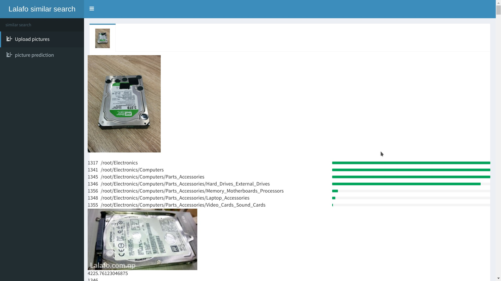

# lalafoAPI

to get categories prediction for your image POST an image file as multipart/form-data to podol.videogorillas.com:4244/upload

example for bash:

```
curl  -F "file=@./test.jpg"   http://podol.videogorillas.com:4244/upload`
```

it will be faster if image is resized to 224x224

```
convert test.jpg -scale 224x224\! resized.jpg
curl  -F "file=@./resized.jpg"  http://podol.videogorillas.com:4244/upload
```


as a result you will the JSON in such format:
```json
{
    "categories": [
        {
            "categoryId": 1317,
            "desc": "/root/Electronics",
            "score": 100.0
        },
        {
            "categoryId": 1341,
            "desc": "/root/Electronics/Computers",
            "score": 100.0
        },
        {
            "categoryId": 1345,
            "desc": "/root/Electronics/Computers/Parts_Accessories",
            "score": 100.0
        },
        {
            "categoryId": 1346,
            "desc": "/root/Electronics/Computers/Parts_Accessories/Hard_Drives_External_Drives",
            "score": 92.30000000000001
        }
    ],
    "nearestProducts": [
        {
            "cat": "1346",
            "dist": 4192.05908203125,
            "url": "files/1346/6396113_hdd-quot-seagate-quot-250gb-31408.jpg"
        },
        {
            "cat": "1346",
            "dist": 4192.05908203125,
            "url": "files/1346/12300_laptop-hard-disk-27384.jpg"
        },
        {
            "cat": "1346",
            "dist": 4193.74072265625,
            "url": "files/1346/1585511_250gb-hard-disk-7003.jpg"
        },
        {
            "cat": "1346",
            "dist": 4193.74072265625,
            "url": "files/1346/976561_hard-disk-160gb-18815.jpg"
        },
        {
            "cat": "1346",
            "dist": 4193.74072265625,
            "url": "files/1346/787477_hdd-80gb-maxtor-sata-9683.jpg"
        }
    ]
}
```

there is debugging UI at http://podol.videogorillas.com:4244/ 

